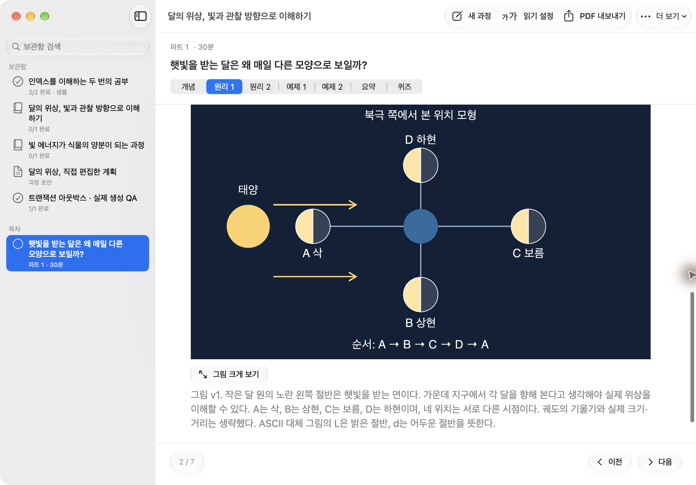
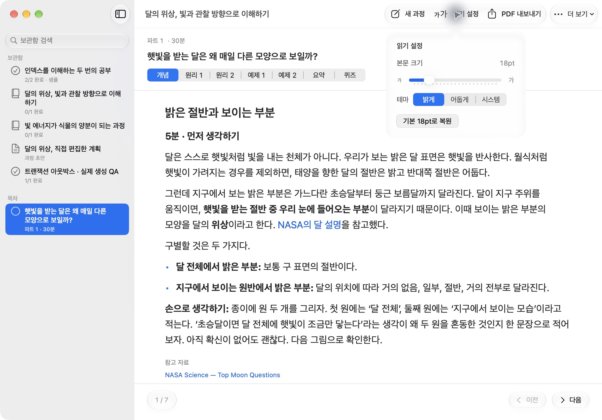
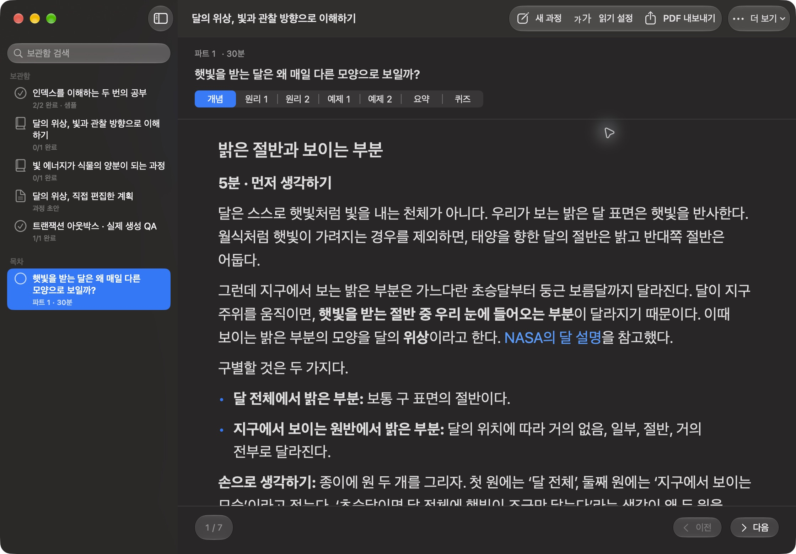

# Study Swift

궁금한 주제를 작은 학습 과정으로 만들고, 교재·그림·퀴즈를 읽으며 공부하는 **Swift 전용 macOS 네이티브 앱**입니다. 기존 [Study TUI](https://github.com/zzoe2346/study-tui)의 학습 흐름을 밝고 읽기 편한 데스크톱 화면으로 옮겼습니다.

기본 본문 **18pt**, **14~36pt 크기 조절**, 밝은·어두운·시스템 테마를 제공합니다. 과학·역사·언어 등 직접 입력한 주제를 공부할 수 있습니다. 생성에는 기존 ChatGPT 구독으로 로그인한 Codex CLI를 사용합니다.

화면은 `NavigationSplitView`·네이티브 사이드바·툴바·Form·Picker·DisclosureGroup으로 구성했습니다. 최신 SDK로 링크해 시스템 탐색·검색·툴바 디자인을 사용하고, macOS 26 이상에서 페이지 이동과 주요 동작에 **실제 Liquid Glass API**를 적용합니다. 상단에는 **새 과정 · 읽기 설정 · PDF 내보내기 · 더 보기**의 이름을 함께 표시합니다. [Apple HIG 적용 기준](docs/design.md)을 문서로 남겼습니다.


## 학습 흐름

1. 주제를 입력하면 목표·범위·종료점이 있는 과정 초안을 만듭니다.
2. 시작 전에 제목·목표·파트·학습 시간을 직접 편집하거나 AI에게 조정을 요청합니다.
3. 30~45분 파트의 개념·원리·예제·시각자료·요약을 읽습니다.
4. 퀴즈는 메모나 종이에 풀고, 원하는 때 정답을 펼칩니다. 점수나 진행 통과 조건은 없습니다.
5. 현재 파트를 직접 완료하며, 모든 확정 파트를 마치면 기본 과정이 완료됩니다. 심화 주제는 선택할 때만 별도 과정으로 이어집니다.

진도·읽던 내용과 스크롤 위치·퀴즈 메모·정답 공개 상태를 자동 저장합니다. 이미 준비한 교재는 AI 호출 없이 다시 읽을 수 있습니다. 보관함 검색과 파트별 PDF도 제공합니다.

## 실제 실행 화면

교재 읽기·어두운 테마·그림은 실제 Codex 구독으로 생성한 달의 위상 주제입니다. 과정 편집 화면은 그 실제 계획을 QA 보관함에 초안으로 복사하고 앱에서 제목을 수정했습니다. 퀴즈는 이번에 앱에서 실제 생성한 트랜잭션 아웃박스 교재입니다. 계획·교재 생성에 두 번의 AI 작업을 사용했고 이후 그림 재시도·재개·PDF 검증은 AI 호출 없이 진행했습니다. 모든 캡처는 최신 SDK로 패키징한 실제 네이티브 앱 화면입니다.

| 과정 초안 편집 | 퀴즈 메모와 선택 정답 공개 |
|---|---|
|  |  |







## 빌드와 실행

macOS 14 이상을 대상으로 하며 **Swift 6 도구와 macOS 26 이상 SDK**가 필요합니다. Xcode 또는 Command Line Tools로 빌드합니다. 실제 실행 검증 환경은 macOS 27.0.1, Apple Silicon, Swift 6.4입니다. 다른 macOS 버전과 Intel Mac 실행은 아직 확인하지 않았습니다.

```sh
git clone https://github.com/zzoe2346/study-swift.git
cd study-swift
swift run PackageApp --release
open "dist/Study Swift.app"
```

`PackageApp`은 실제 SDK 버전과 macOS 14 최소 버전을 구분해 링크하고 실행 파일의 SDK 기록을 검증합니다. 로컬 Mermaid·스키마 리소스를 포함하는 `.app`을 만들고 ad-hoc 서명합니다. Python, 별도 HTTP 서버, 외부 Swift 패키지가 필요하지 않습니다. 개발자 인증서 서명·공증·App Store 배포는 제공하지 않습니다.

샘플을 전용 보관함에서 실행하려면 다음 명령을 사용합니다. 샘플 표시와 읽기는 AI를 호출하지 않습니다.

```sh
swift run StudySwift --demo --data-dir ./data/demo
```

처음 실행한 앱의 **샘플 교재 둘러보기**에서도 고정 샘플을 열 수 있습니다.

## 교재 생성 준비

[Codex 인증 안내](https://developers.openai.com/codex/auth)에 따라 Codex CLI를 설치하고 ChatGPT로 로그인합니다.

```sh
codex login
codex login status
```

앱은 `Logged in using ChatGPT` 인증을 확인합니다. GUI에서 실행 파일을 찾지 못하면 **Study Swift → Settings… → Codex 실행 파일**에 경로를 입력하세요. CLI 0.160.1에서 실제 생성·네이티브 삽화를 검증했습니다. 이후 CLI 변경으로 사용 기능이 달라질 수 있습니다.

생성에는 구독 한도가 적용됩니다. API 키나 별도 유료 API로 전환하지 않습니다. AI 생성은 원격 서비스에 의존하며, 취소·시간 제한·실패 시 기존 교재를 유지합니다. 자동 무한 재시도는 하지 않습니다.

## 그림, PDF, 가져오기

Mermaid와 안전한 SVG는 앱 안의 로컬 WebKit에서 PNG로 렌더링합니다. 필요한 삽화는 Codex의 네이티브 이미지 기능으로 생성합니다. 원본을 사용할 수 없으면 교재에 미리 저장된 대체 후보를 순서대로 사용하고, 마지막 ASCII 도식을 표시합니다. **더 보기 → 원본 그림 재시도**에서 다시 준비할 수 있습니다. **그림 크게 보기**는 저장된 원본을 기본 이미지 앱에서 엽니다. ASCII와 코드의 줄·공백은 보존하며, 폭이 부족하면 가로로 스크롤합니다.

PDF는 AppKit·CoreText·CoreGraphics로 생성합니다. 본문·예제·화면과 같은 선택 그림·퀴즈를 포함하고, **정답과 해설은 문제 이후의 새 페이지**에서 시작합니다.

기존 교재의 `lesson.json`을 상단 **더 보기 → 교재 가져오기**로 열 수 있습니다. 파일을 검증하고 그림을 로컬로 준비하며 AI를 호출하지 않습니다. 생성 삽화가 필요하면 저장된 대체 후보를 사용합니다. 기존 SQLite 보관함 전체 자동 이전은 제공하지 않습니다.

## 단축키와 저장

| 동작 | 단축키 |
|---|---|
| 새 학습 과정 | ⌘N |
| 파트 PDF 내보내기 | ⌘P |
| 본문 크게 / 작게 | ⌘+ / ⌘− |
| 기본 18pt | ⌘0 |
| 이전 / 다음 내용 | ⌘[ / ⌘] |
| 앱 설정 | ⌘, |

학습 데이터는 기본적으로 `~/Library/Application Support/StudySwift`의 `library.json`, `materials/`, `jobs/`에 저장합니다. `--data-dir`로 별도 폴더를 지정할 수 있습니다. 크기·테마·CLI 경로는 macOS 사용자 설정에 저장합니다. 인증 파일은 기존 Codex 위치를 사용하며 복사하지 않습니다.

## 개발과 QA

```sh
swift run RunTests
swift run StudyQA --data-dir ./work/local-qa --render-demo --stress-pdf --reopen
```

`RunTests`는 Swift Testing을 실행합니다. Command Line Tools 환경에서는 필요한 Testing 매크로 플러그인을 자동으로 찾습니다. 로컬 QA는 AI를 호출하지 않으며 그림과 PDF의 모든 페이지 PNG를 QA 폴더에 저장합니다.

실제 구독 호출은 명시적으로 다음 옵션을 선택할 때 실행합니다.

```sh
swift run StudyQA --data-dir ./work/live-qa --live --live-image
swift run StudyQA --data-dir ./work/live-qa --reopen --export-saved
swift run StudyQA --data-dir ./work/live-qa --verify-saved-visuals
```

구조·진도·저장·CLI 종료/취소·시각자료 안전성·PDF를 검증합니다. 실제 호출, UI 조작, PDF 페이지 검토와 검증 한계는 [QA 기록](docs/qa.md)에 구분해서 기록했습니다. 생성 구조 검증은 교재의 모든 사실이나 실제 학습 시간을 보증하지 않습니다.

- [요구사항](docs/requirements.md)
- [상세설계](docs/lld.md)
- [macOS 디자인 기준](docs/design.md)
- [추가 스킬·툴바 디자인 검토](docs/design-review.md)
- [협업·Git 규칙](AGENTS.md)

프로젝트 코드는 [MIT](LICENSE), 포함한 Mermaid 런타임은 [별도 MIT 고지](Sources/StudyCore/Resources/NOTICE.md)를 따릅니다.
