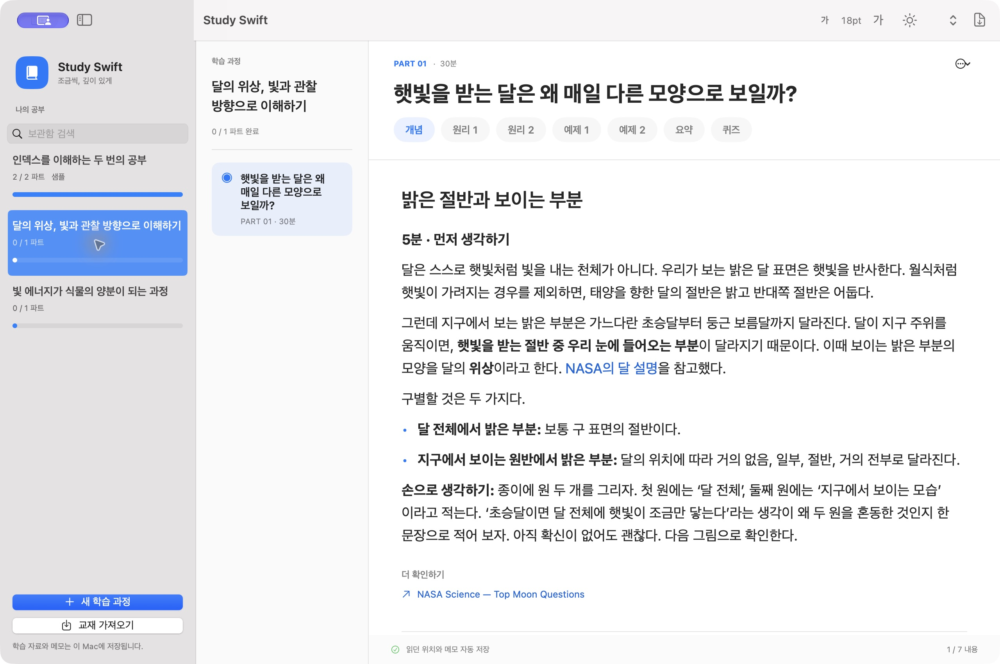
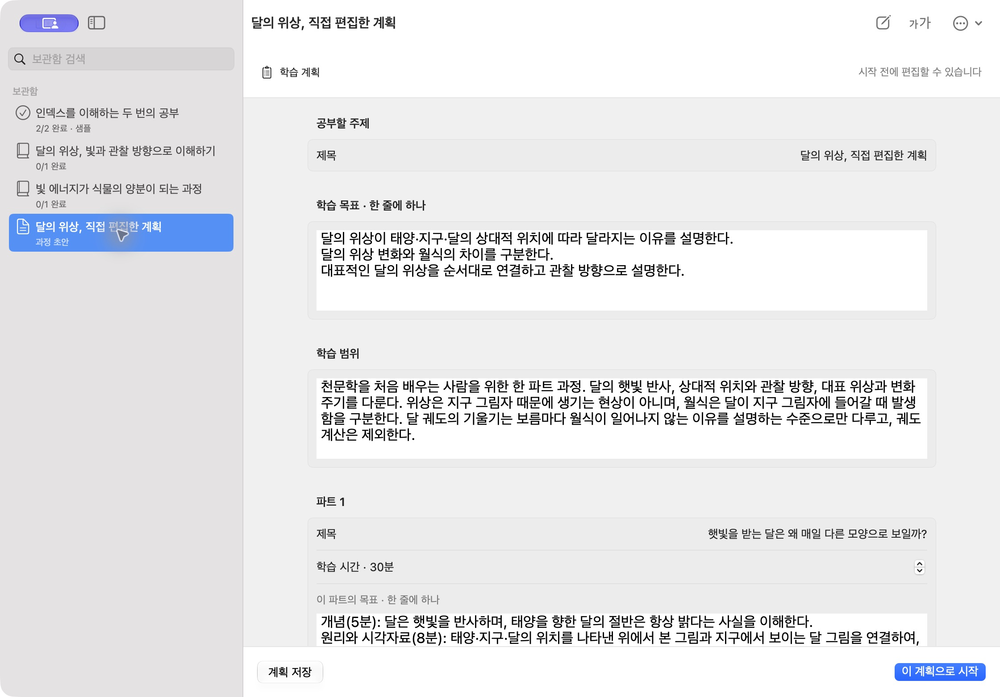
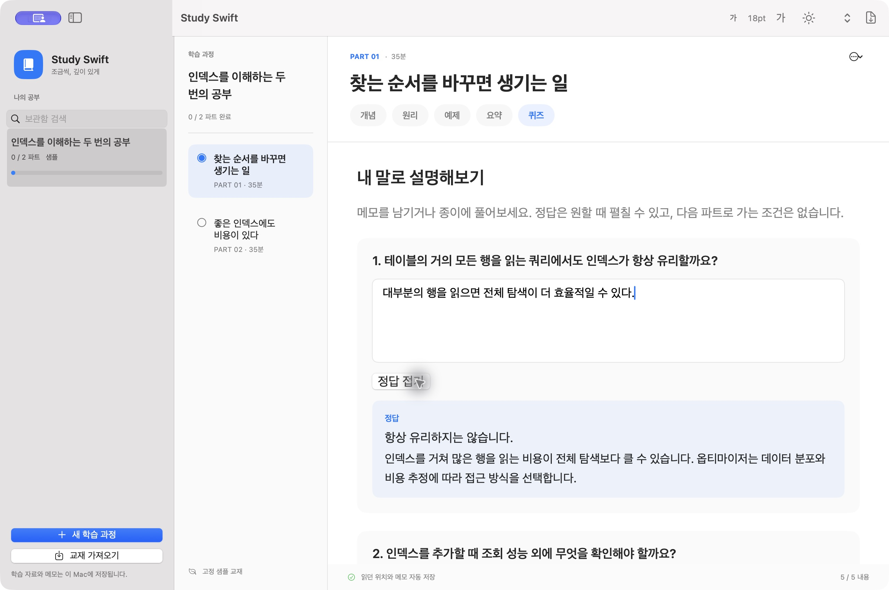

<p align="center">
  
</p>

<h1 align="center">Study Swift</h1>

관심 있는 주제를 학습 과정으로 만들고, 교재와 그림을 읽으며 퀴즈로 복습하는 macOS 앱입니다. 과학, 역사, 언어처럼 배우고 싶은 주제를 직접 입력해 시작할 수 있습니다.



## 주요 기능

- AI가 만든 학습 계획을 편집하고, 30~45분 분량의 파트로 나누어 공부합니다.
- 교재의 설명과 그림을 읽고 퀴즈를 메모로 풉니다. 정답은 원하는 때 펼칠 수 있습니다.
- 글자 크기를 14~36pt로 조절하고 밝은 테마, 어두운 테마 또는 시스템 설정을 선택합니다.
- 읽던 위치와 메모를 자동 저장합니다. 교재를 가져오거나 파트별 PDF로 내보낼 수도 있습니다.

| 학습 계획 편집 | 퀴즈와 메모 |
|---|---|
|  |  |

더 많은 화면과 캡처 정보는 [QA 기록](docs/qa.md)에 있습니다.

## 설치와 실행

빌드에는 Swift 6 도구와 macOS 26 이상 SDK가 필요합니다. Xcode 또는 Command Line Tools를 사용할 수 있습니다.

```sh
git clone https://github.com/zzoe2346/study-swift.git
cd study-swift
swift run PackageApp --release
open "dist/Study Swift.app"
```

macOS 14 이상을 대상으로 합니다. 현재 실행을 확인한 환경은 macOS 27.0.1의 Apple Silicon Mac이며, 다른 OS와 Intel Mac은 아직 확인하지 않았습니다. 로컬 빌드는 ad-hoc 서명을 사용하며 공증된 배포본은 아닙니다. 자세한 지원 범위는 [호환성 안내](docs/compatibility.md)를 참고하세요.

처음 실행하면 **샘플 교재 둘러보기**로 로그인 없이 읽기 기능을 살펴볼 수 있습니다.

## 교재 생성

[Codex CLI](https://developers.openai.com/codex/cli)를 설치하고 기존 ChatGPT 구독으로 로그인합니다.

```sh
codex login
```

새 과정에서 주제를 입력한 뒤 학습 계획을 확인하고 시작하세요. 생성에는 인터넷 연결이 필요하며 구독 한도가 적용됩니다. 준비된 교재는 다시 생성하지 않고 읽을 수 있습니다.

CLI 경로 설정, 단축키, 그림 복구와 저장 위치는 [사용 안내](docs/usage.md)에 정리했습니다.

## 개발

```sh
./scripts/check.sh
```

소스 구조와 검사 방법은 [개발 안내](docs/development.md)를, 기여 규칙은 [AGENTS.md](AGENTS.md)를 참고하세요. 프로젝트는 [Study TUI](https://github.com/zzoe2346/study-tui)의 학습 흐름을 이어받았습니다.

## 라이선스

[MIT](LICENSE). 포함된 Mermaid 런타임의 라이선스는 [별도 고지](Sources/StudyCore/Resources/NOTICE.md)에 있습니다.
